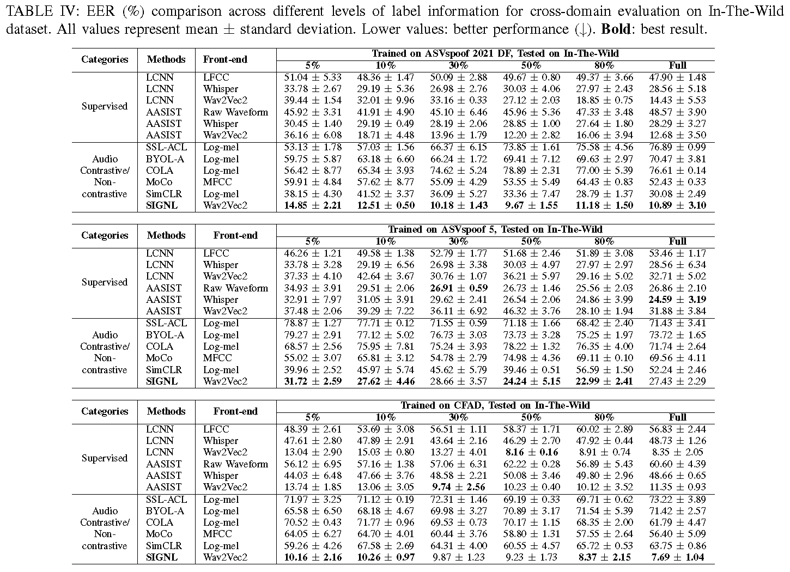

# SIGNL: Spatio-Temporal Vision Graph Non-Contrastive Learning

This repository contains the implementation of SIGNL, submitted to the 41st IEEE International Conference on Data Engineering (ICDE) 2025.


# Installation

This code requires Python 3.9 or higher.

```bash
pip3 install torch==2.2.1 torchvision==0.17.1 torchaudio==2.2.1 --index-url https://download.pytorch.org/whl/cu121
pip3 install torch-cluster -f https://data.pyg.org/whl/torch-2.2.1+cu121.html
pip3 install -r requirements.txt
```

# Dataset

- ASVSpoof 2019 Train and Dev: [Download](https://datashare.ed.ac.uk/handle/10283/3336)
- ASVSpoof 2021 DF Dataset: [Download](https://zenodo.org/records/4835108)
- For ASVSpoof5, kindly contact to the provider to get the dataset: [https://www.asvspoof.org/](https://www.asvspoof.org/).
- CFAD: [Download](https://zenodo.org/records/8122764)
- In-The-Wild Dataset: [Download](https://owncloud.fraunhofer.de/index.php/s/JZgXh0JEAF0elxa)

# Dataset management

This procedure will be updated soon.

# Evaluation using pre-trained model

1. **Download Model**  
   - [Download here](https://drive.google.com/drive/folders/16F1vfRSpuRWV4bj9xwHhtzXIPdRHpYbo?usp=sharing) and save to `./models`.  
   - Look for filenames starting with **"pretrained_"** (e.g., `pretrained_W2VSIGNL_CFAD_ep100_bs96_lb100.ckpt`). `lb100` indicates that the model was build with full label information

2. **Run Command**  
    ```bash
    python main.py --eval_cls True --dataset <dataset_name> --encoder_file <encoder_file>
    ```

    Examples:
   - Full labels:  
     ```bash
     python main.py --eval_cls True --dataset CFAD --encoder pretrained_SIGNL_CFAD_ep100_bs96_lb100.ckpt
     ```
   - 5% labels:  
     ```bash
     python main.py --eval_cls True --dataset CFAD --encoder pretrained_SIGNL_CFAD_ep100_bs96_lb5.ckpt
     ```


# Use pre-trained encoders for the downstream training

1. **Download Encoder**  
   - [Download here](https://drive.google.com/drive/folders/16F1vfRSpuRWV4bj9xwHhtzXIPdRHpYbo?usp=sharing) and save to `./models`.  
   - Look for filenames starting with **"encoder_"** (e.g., `encoder_W2VSIGNL_CFAD_ep100_bs96.ckpt`).

2. **Run Command**  
    ```bash
    python main.py --training_type classifier --dataset <dataset_name> --encoder_file <encoder_file> --epoch <number_of_epochs> --label_ratio <label_availability_ratio>
    ```
    Example:
    ```bash
    python main.py --training_type classifier --dataset CFAD --encoder encoder_SIGNL_CFAD_ep100_bs96.ckpt --epoch 100 --label_ratio 0.8
    ```  

# Run from the sratch

Example to run SIGNL's pre-training and downstream training:

1. **Pre-train the encoders**  
    ```bash
    python main.py --training_type encoder --dataset <dataset_name> --epoch <number_of_epochs>
    ```

    For example:
    ```bash
    python main.py --training_type encoder --dataset CFAD --epoch 100
    ```
2. **Downstream training**  
    Get the recently pre-trained encoder file under `./models` (e.g., `encoder_W2VSIGNL_CFAD_ep100_bs96.ckpt`).

    Start the downstream training:
    ```bash
    python main.py --training_type classifier --dataset CFAD --encoder encoder_SIGNL_CFAD_ep100_bs96.ckpt --epoch 100 --label_ratio 0.8
    ```  


## In-Domain Results


## Cross-Domain Results


# Cite this work
TBD

